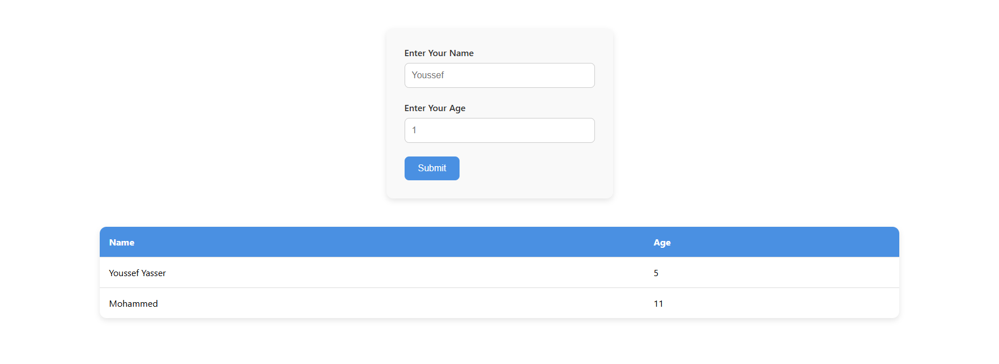

# React Form to Table

A simple React project demonstrating how to collect user input via a form and display the data in a table dynamically.

## 🚀 Features

* Controlled form using `useState`
* Reusable `Form` and `List` components
* Clean, responsive CSS styling
* Data reset after form submission
* Shows placeholder text when no data is present

## 🧩 Components

### `Form`

* Accepts `setArr` as a prop to update the data array
* Uses a single `handleChange` function for multiple fields
* Clears input fields after submit

### `List`

* Accepts `arr` as a prop and renders it in a styled table
* Displays a message when no data is available

## 🛠️ Getting Started

### 1. Clone the Repo

```bash
git clone https://github.com/your-username/react-form-table-crud.git
cd react-form-table-crud
```

### 2. Install Dependencies

```bash
npm install
```

### 3. Start the Development Server

```bash
npm start
```

## 📸 Preview



## ✨ Demo

Form input:

* Name: Text input
* Age: Number input

Table output:

* Dynamically shows all submitted entries

## 📌 Notes

* This is a simple starter for understanding form handling and component communication in React.
* Feel free to extend this with local storage, validation, or delete/edit functionality.
